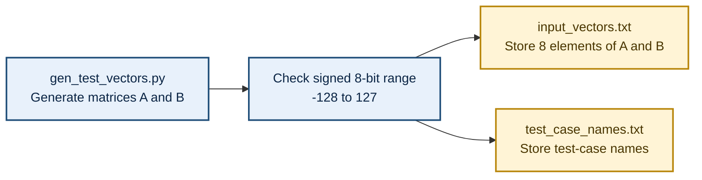
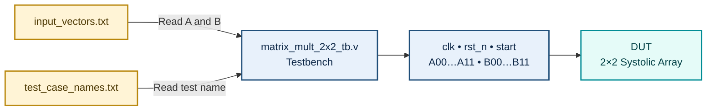
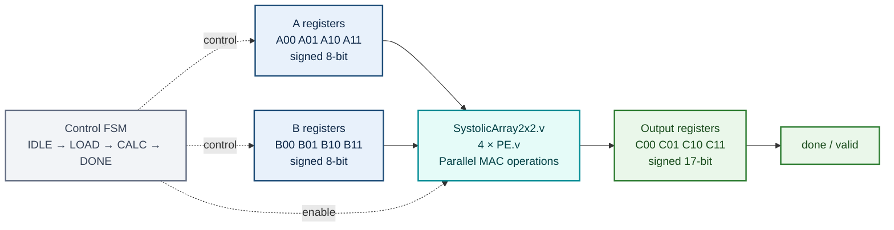
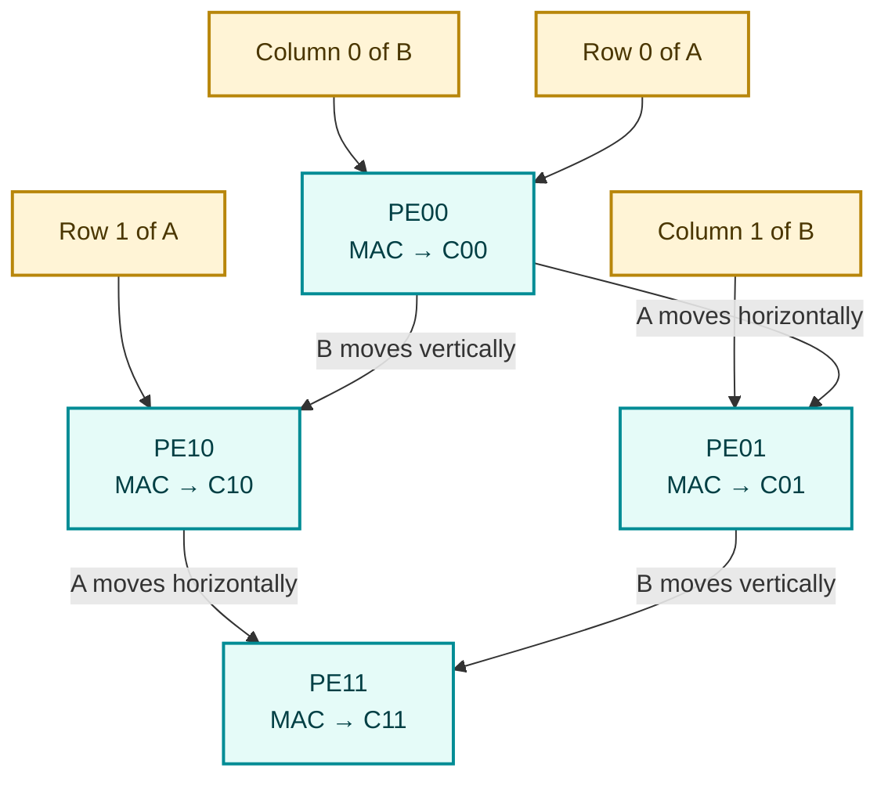
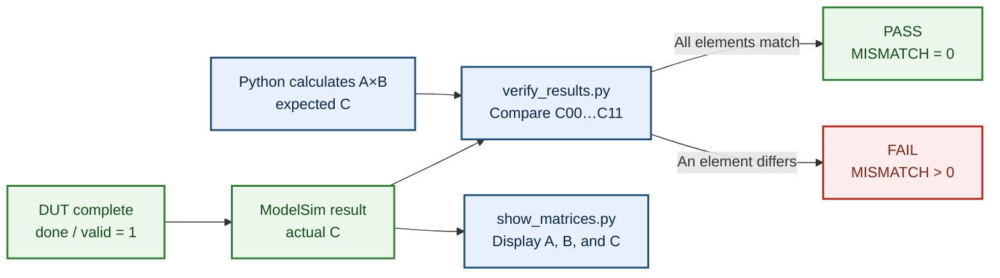
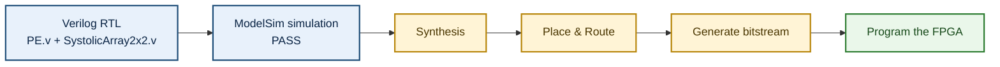

## Authors

**Võ Hoàng Minh Lộc · Trần Thiên Phúc**  
**Advisor:** Dr. Phạm Thế Vinh  
Faculty of Semiconductor Integrated Circuits and Automotive Engineering, FPT University Ho Chi Minh City Campus, Vietnam

---

# 2×2 Matrix Multiplier Using a Systolic Array

**Technologies:** Verilog, ModelSim, and Python

## File Descriptions

### `PE.v`

**Purpose:** This file defines a Processing Element (PE), the fundamental processing unit of the systolic array. Each PE performs a multiply–accumulate (MAC) operation while storing and forwarding data to the next PE.

**How it works:** At every rising clock edge, the PE receives two signed 8-bit values, A and B. It calculates `A × B` and adds the product to an accumulator register. The product of two 8-bit values requires 16 bits. Because each output element of matrix C is the sum of two products, a signed 17-bit accumulator is used to prevent overflow. Matrix A data moves horizontally to the right, while matrix B data moves vertically downward.

**Example:** Assume that the PE is calculating `C00`:

```text
Cycle 1: A00 = 1, B00 = 5  → accumulator = 0 + 1×5 = 5
Cycle 2: A01 = 2, B10 = 7  → accumulator = 5 + 2×7 = 19
Final result: C00 = 19
```

Boundary case:

```text
(-128)×(-128) + (-128)×(-128) = 32768
```

Therefore, a signed 17-bit output is required.

### `SystolicArray2x2.v`

**Purpose:** This is the main RTL module. It connects four PEs to form a 2×2 systolic array. The four PEs calculate the four output elements `C00`, `C01`, `C10`, and `C11`.

**How it works:** The module distributes matrix A data horizontally and matrix B data vertically. All PEs operate in parallel under the same clock. Each PE performs two MAC operations to calculate one element of matrix C. The module also receives a reset signal to clear previous results and produces four signed 17-bit outputs. This module, together with `PE.v`, can be synthesized and implemented on an FPGA.

**Example:**

```text
A = [[1, 2],        B = [[5, 6],
     [3, 4]]             [7, 8]]

C00 = 1×5 + 2×7 = 19     C01 = 1×6 + 2×8 = 22
C10 = 3×5 + 4×7 = 43     C11 = 3×6 + 4×8 = 50

Result: C = [[19, 22], [43, 50]]
```

### `matrix_mult_2x2_tb.v`

**Purpose:** This is the testbench used to simulate and verify the two RTL files in ModelSim. A testbench is not physical hardware, so it is not synthesized or programmed onto the FPGA.

**How it works:** The file generates the clock, activates reset, reads each test case from `input_vectors.txt`, and applies the eight matrix elements `A00…A11` and `B00…B11` to the design. After the required number of cycles, the testbench reads `C00…C11` and prints the output matrix in the ModelSim Transcript window or writes it to a file for Python verification. This process is repeated for every test case.

**Simulation example:**

```text
Reset = 1 → clear the PE results
Reset = 0 → apply A = [[1,2],[3,4]], B = [[5,6],[7,8]]
Wait until the circuit finishes → read C = [[19,22],[43,50]]
Possible Transcript output: TEST 1 - Positive basic - COMPLETED
```

### `input_vectors.txt`

**Purpose:** This text file contains the input data for all test cases. By reading data from a file, the testbench can automatically test many matrices without modifying the Verilog source code.

**How it works:** Each line normally contains eight signed 8-bit values: four elements of matrix A followed by four elements of matrix B. The tests should cover positive numbers, negative numbers, zeros, identity matrices, the boundary values `-128` and `127`, all-negative matrices, zero results, sign changes, and values near the overflow limit.

**Example line:**

```text
1 2 3 4 5 6 7 8
```

This line represents:

```text
A = [[1,2],[3,4]]
B = [[5,6],[7,8]]
Expected C = [[19,22],[43,50]]
```

### `test_case_names.txt`

**Purpose:** This file contains the name or label of every test case in the same order as the data lines in `input_vectors.txt`. It makes the simulation results easier to read and helps identify which test has failed.

**How it works:** When the testbench processes line `n` from `input_vectors.txt`, it uses line `n` from `test_case_names.txt` as the displayed test name. Therefore, the number and order of names must match the number and order of the input vectors.

**Example content:**

```text
Positive basic
Contains negative values
Zero matrix A
Identity matrix
Maximum and minimum values
```

If the second test fails, ModelSim or Python may report:

```text
MISMATCH - Contains negative values
```

### `gen_test_vectors.py`

**Purpose:** This Python program creates matrix test cases and writes them to `input_vectors.txt`. It provides the input data for automated verification.

**How it works:** The program can include fixed tests and generate additional random matrices. Before writing the data, it checks that every element is within the signed 8-bit range from `-128` to `127`. It may also calculate the expected software result for later comparison.

**Example generated data:**

```text
A = [[-1, 2], [3, -4]]
B = [[5, -6], [-7, 8]]

Line written to input_vectors.txt:
-1 2 3 -4 5 -6 -7 8

Software result: C = [[-19, 22], [43, -50]]
```

### `show_matrices.py`

**Purpose:** This Python program displays data in an easy-to-read 2×2 matrix format. It is used for visualization and presentation only; it does not control the FPGA or modify the simulation results.

**How it works:** The program reads eight input values or saved output values and arranges them into the rows and columns of matrices A, B, and C. This helps detect incorrect element ordering.

**Example output:**

```text
Matrix A:        Matrix B:
[1  2]           [5  6]
[3  4]           [7  8]

Result C:
[19 22]
[43 50]
```

### `verify_results.py`

**Purpose:** This is the golden-model verification program. It checks whether the Verilog circuit produces the same matrix-multiplication result as the software calculation.

**How it works:** The program reads matrices A and B, calculates the expected matrix C using the matrix-multiplication formula, and then reads the actual result generated by ModelSim and the testbench. It compares `C00`, `C01`, `C10`, and `C11` for every test case, counts matches and mismatches, and reports the final result.

**Correct-result example:**

```text
Expected: [[19,22],[43,50]]
ModelSim: [[19,22],[43,50]]
MATCH = 4, MISMATCH = 0 → PASS
```

**Mismatch example:**

```text
Expected C11 = 50, Actual C11 = 49
MATCH = 3, MISMATCH = 1 → FAIL
```

> **Note:** The two main RTL files used for hardware synthesis are `PE.v` and `SystolicArray2x2.v`. The remaining files are used for test generation, simulation, visualization, and result verification.

---

# Step-by-Step Block Diagrams

## Step 1. Generate Test Data with Python

`gen_test_vectors.py` creates matrices A and B with signed 8-bit elements and writes the test data to two text files.



Example line in `input_vectors.txt`:

```text
1 2 3 4 5 6 7 8
```

This represents `A = [[1,2],[3,4]]` and `B = [[5,6],[7,8]]`.

---

## Step 2. Apply Test Data to the Design

The testbench reads each data set, generates the clock, reset, and start signals, and applies the matrix elements to the DUT in ModelSim.



The `matmul2x2.mpf` project file stores the ModelSim settings required to compile and run the testbench.

---

## Step 3. Internal DUT Architecture

The DUT contains input registers, a control FSM, a four-PE array, and output registers.



The two main RTL files in the DUT are `PE.v` and `SystolicArray2x2.v`.

---

## Step 4. Data Flow Through the Four-PE Array

Matrix A moves horizontally, while matrix B moves vertically. Each PE performs two multiply–accumulate operations to calculate one element of matrix C.



Matrix-multiplication equations:

```text
C00 = A00×B00 + A01×B10
C01 = A00×B01 + A01×B11
C10 = A10×B00 + A11×B10
C11 = A10×B01 + A11×B11
```

---

## Step 5. Collect and Verify the Results

When `done/valid = 1`, the testbench reads the four output elements. Python calculates the golden result and compares every element.



Correct-result example:

```text
Expected: [[19,22],[43,50]]
ModelSim: [[19,22],[43,50]]
MATCH = 4, MISMATCH = 0 → PASS
```

---

## Step 6. Implement the Design on an FPGA

After successful simulation and verification, the two RTL files are synthesized to generate a bitstream for the FPGA.



## Workflow Summary

```text
Python generates the test data
        ↓
The testbench reads the data and controls the DUT
        ↓
Four PEs perform multiply–accumulate operations
        ↓
ModelSim produces matrix C
        ↓
Python compares the results and reports PASS or FAIL
        ↓
The design is synthesized and programmed onto the FPGA
```
