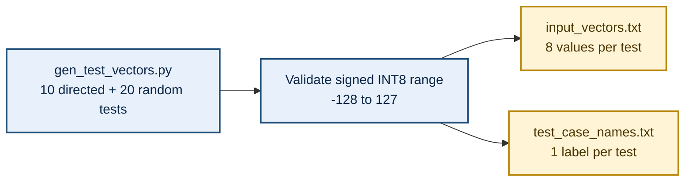
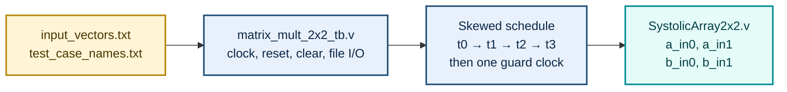
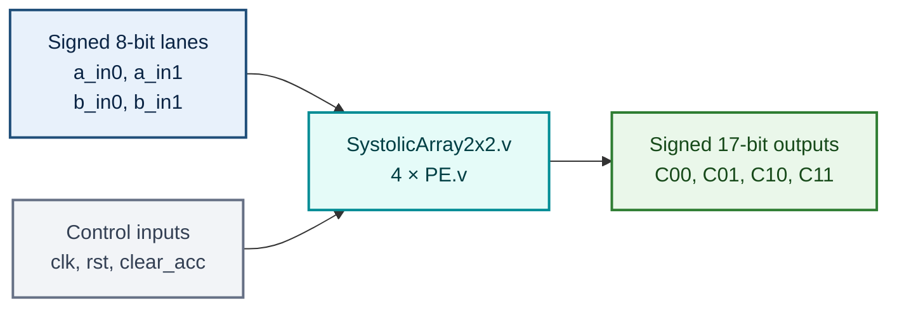
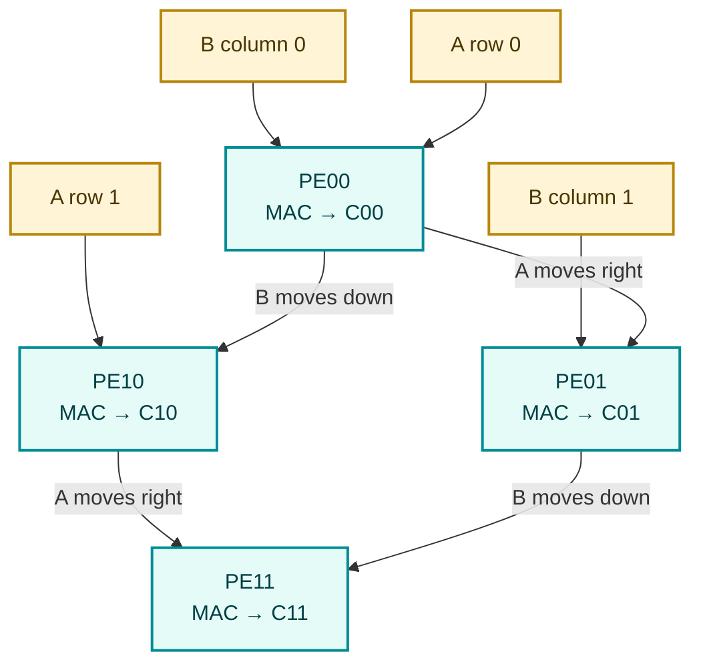
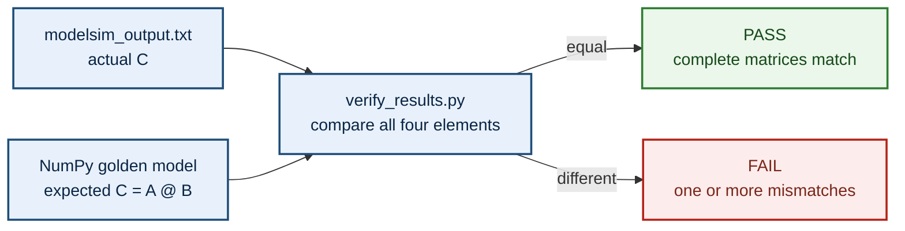
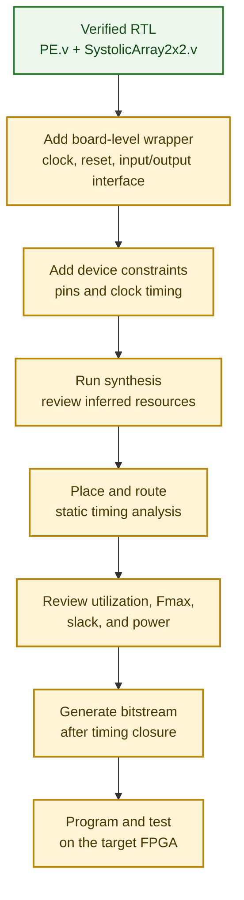

# 2×2 Matrix Multiplier Using a Systolic Array on FPGA

A synthesizable Verilog RTL implementation of a signed 2×2 matrix multiplier using a four-cell systolic array. Matrix elements are represented as **signed INT8 values**, while every output element is accumulated in **signed 17-bit precision** to preserve the full mathematical result without overflow.

The design is verified with a file-driven ModelSim testbench and an independent NumPy golden model. The checked-in dataset contains **30 test cases**—10 directed corner cases and 20 deterministic random cases—and the recorded RTL output matches Python for **30/30 matrices and 120/120 output elements**.

---

## Authors

**Võ Hoàng Minh Lộc · Trần Thiên Phúc**  
**Advisor: ThS. Phạm Thế Vinh** 

Faculty of Semiconductor Integrated Circuits and Automotive Engineering, FPT University Ho Chi Minh City Campus, Vietnam

---

## Key Results

| Item | Result |
|---|---:|
| Matrix size | 2×2 |
| Input format | Signed INT8 (`-128` to `127`) |
| Output format | Signed 17-bit |
| Processing elements | 4 parallel MAC cells |
| Directed test cases | 10 |
| Random test cases | 20, generated with seed `42` |
| Verified matrices | **30/30 PASS** |
| Verified output elements | **120/120 match** |
| Maximum checked output | `32768` |

> The repository contains simulation results and software verification. FPGA synthesis, timing, resource-utilization, board constraints, and bitstream files are not yet included.

---

## Scope

This project focuses on the arithmetic datapath and verification flow for one signed 2×2 matrix multiplication:

- Four reusable Processing Elements (`PE.v`)
- A 2×2 systolic interconnect (`SystolicArray2x2.v`)
- Skewed input scheduling performed by the testbench
- File-driven ModelSim simulation
- Independent post-processing verification with Python and NumPy

The current RTL is a small, educational systolic-array core. It does not yet include a board-level top module, an FSM, a `valid/ready` interface, memory-mapped I/O, an AXI interface, or a continuous stream of back-to-back matrices.

---

## Matrix Multiplication

For two matrices:

```text
        | A00  A01 |          | B00  B01 |
A   =   |          |    B  =  |          |
        | A10  A11 |          | B10  B11 |
```

the result is:

```text
        | C00  C01 |
C   =   |          |
        | C10  C11 |
```

where:

```text
C00 = A00×B00 + A01×B10
C01 = A00×B01 + A01×B11
C10 = A10×B00 + A11×B10
C11 = A10×B01 + A11×B11
```

Each output therefore requires two signed multiplications and one accumulation.

---

## Architecture

The hardware consists of four identical PEs connected as a 2×2 systolic array.

The complete system and PE-level data flow are presented in the Mermaid block diagrams below. These diagrams render directly on GitHub and do not require separate image files.

### Processing Element (`rtl/PE.v`)

Each PE contains:

- One signed `8×8 → 16-bit` multiplier
- One signed 17-bit accumulator
- An 8-bit horizontal forwarding register for matrix A
- An 8-bit vertical forwarding register for matrix B
- A synchronous `clear_acc` input that clears only the accumulated sum
- An asynchronous active-high `rst` input that clears forwarding registers and the accumulator

At every rising clock edge:

```text
a_out   ← a_in
b_out   ← b_in
sum_out ← sum_out + sign_extend(a_in × b_in)
```

When `clear_acc = 1`, `sum_out` is set to zero before a new matrix multiplication.

### Systolic Array (`rtl/SystolicArray2x2.v`)

The top RTL module instantiates four PEs:

| PE | A source | B source | Output |
|---|---|---|---|
| `PE00` | `a_in0` | `b_in0` | `C00` |
| `PE01` | `PE00.a_out` | `b_in1` | `C01` |
| `PE10` | `a_in1` | `PE00.b_out` | `C10` |
| `PE11` | `PE10.a_out` | `PE01.b_out` | `C11` |

`PE00` is closest to the external inputs, while `PE11` is the farthest cell and produces the last completed result.

---

## Skewed Input Schedule

The testbench aligns matrix elements in time so that the correct A and B values meet inside every PE.

| Cycle | `a_in0` | `a_in1` | `b_in0` | `b_in1` | Main operations |
|---|---:|---:|---:|---:|---|
| `t0` | `A00` | `0` | `B00` | `0` | `PE00`: first term of `C00` |
| `t1` | `A01` | `A10` | `B10` | `B01` | `PE00`: second `C00` term; `PE01`/`PE10`: first terms |
| `t2` | `0` | `A11` | `0` | `B11` | `PE01`/`PE10`: second terms; `PE11`: first term |
| `t3` | `0` | `0` | `0` | `0` | `PE11`: second term of `C11` |

The testbench then waits one additional guard clock before writing `C00`, `C01`, `C10`, and `C11` to `modelsim_output.txt`.

This version does not generate `done` or `valid`. Output timing is controlled by the known four-cycle schedule in `matrix_mult_2x2_tb.v`.

---

## Bit-Width Rationale

Each input is a signed 8-bit two's-complement value:

```text
-128 ≤ Aij, Bij ≤ 127
```

The exact signed product range is:

```text
-16256 ≤ Aij × Bij ≤ 16384
```

Therefore, every partial product requires signed 16-bit storage. Each output is the sum of two products:

```text
Cij = product_0 + product_1
```

The largest positive case is:

```text
(-128 × -128) + (-128 × -128) = 32768
```

Because signed 16-bit arithmetic stops at `32767`, the accumulator and outputs are widened to signed 17-bit.

---

## Verification Strategy

Verification uses two independent paths: ModelSim produces the actual RTL results, while NumPy calculates the expected matrix from the original inputs. `verify_results.py` compares both complete 2×2 matrices.

### Layer 1 — Directed Corner Cases

The generator includes 10 directed tests:

1. Both matrices are zero
2. Identity matrix multiplied by an arbitrary matrix
3. Arbitrary matrix multiplied by the identity matrix
4. Both matrices contain only negative values
5. Maximum signed INT8 value (`127`)
6. Minimum signed INT8 value (`-128`), producing the maximum checked result `32768`
7. Mixed extreme values (`127` and `-128`)
8. Sign changes during accumulation
9. Products that cancel to zero
10. Alternating zeros, negative values, and positive values

### Layer 2 — Deterministic Random Tests

`gen_test_vectors.py` adds 20 random matrix pairs across the full signed INT8 range. The seed is fixed to `42`, so the dataset is reproducible.

### Layer 3 — Independent Golden Model

`verify_results.py` reconstructs A and B with NumPy and calculates:

```python
C_expected = A @ B
```

It then compares the complete 2×2 matrix against the ModelSim result using `numpy.array_equal()`.

### Verified Repository Result

The checked-in files were re-evaluated directly from this repository:

```text
TOTAL: 30 PASS / 0 FAIL / 30 tests
Element-level result: 120 / 120 output values match
```

Representative boundary result:

```text
A = [[-128, -128], [-128, -128]]
B = [[-128, -128], [-128, -128]]
C = [[32768, 32768], [32768, 32768]]
```

---

## Repository Structure

```text
.
├── rtl/
│   ├── PE.v                       # Signed 8-bit MAC processing element
│   └── SystolicArray2x2.v         # Four-PE 2×2 systolic array
├── sim/
│   └── matrix_mult_2x2_tb.v       # File-driven ModelSim testbench
├── golden_model/
│   ├── gen_test_vectors.py        # Directed + random test generation
│   ├── show_matrices.py           # Human-readable matrix display
│   └── verify_results.py          # NumPy golden-model comparison
├── data/
│   ├── input_vectors.txt          # 30 A/B input pairs
│   └── test_case_names.txt        # Matching test labels
├── result/
│   └── modelsim_output.txt        # Checked-in RTL output
└── README.md
```

---

## File Summary

| File | Role |
|---|---|
| `rtl/PE.v` | Performs signed multiply–accumulate and forwards A/B data |
| `rtl/SystolicArray2x2.v` | Connects four PEs into a 2×2 systolic array |
| `sim/matrix_mult_2x2_tb.v` | Applies the skewed schedule and writes ModelSim results |
| `golden_model/gen_test_vectors.py` | Generates 10 directed and 20 random tests |
| `golden_model/show_matrices.py` | Prints A, B, and C in matrix form |
| `golden_model/verify_results.py` | Compares RTL results with NumPy |
| `data/input_vectors.txt` | Stores eight signed inputs per test case |
| `data/test_case_names.txt` | Stores the test descriptions |
| `result/modelsim_output.txt` | Stores four signed outputs per test case |

---

## Detailed File Descriptions

### `rtl/PE.v`

**Purpose:** Defines one Processing Element (PE), the fundamental compute cell of the systolic array. Each PE performs a signed multiply–accumulate operation and forwards its A and B operands to neighboring cells.

**Inputs and outputs:**

- `clk`: common rising-edge clock.
- `rst`: asynchronous active-high reset for the accumulator and forwarding registers.
- `clear_acc`: synchronous signal that clears only the accumulated sum before a new matrix multiplication.
- `a_in`, `b_in`: signed 8-bit operands.
- `a_out`: registered A value forwarded horizontally.
- `b_out`: registered B value forwarded vertically.
- `sum_out`: signed 17-bit accumulated result.

At each rising clock edge, the PE registers the incoming operands and adds their signed product to the accumulator:

```text
a_out   ← a_in
b_out   ← b_in
sum_out ← sum_out + sign_extend(a_in × b_in)
```

Example for the PE that calculates `C00`:

```text
First MAC:   1×5 = 5       → accumulator = 5
Second MAC:  2×7 = 14      → accumulator = 19
Final C00:                     19
```

### `rtl/SystolicArray2x2.v`

**Purpose:** Connects four `PE.v` instances into a 2×2 systolic array. The four cells accumulate `C00`, `C01`, `C10`, and `C11` simultaneously as the skewed operands propagate through the array.

**External interface:**

- Two signed 8-bit A lanes: `a_in0`, `a_in1`.
- Two signed 8-bit B lanes: `b_in0`, `b_in1`.
- Common `clk`, `rst`, and `clear_acc` controls.
- Four signed 17-bit outputs: `C00`, `C01`, `C10`, and `C11`.

The current module is a datapath only. It does not contain `start`, `done`, `valid`, `ready`, an input register bank, or a controller FSM. Input alignment and completion timing are controlled by the testbench.

### `sim/matrix_mult_2x2_tb.v`

**Purpose:** Provides a non-synthesizable ModelSim testbench for the RTL design.

**Operation:**

1. Generates the clock.
2. Applies `rst` to initialize all PEs.
3. Reads each matrix pair from `input_vectors.txt`.
4. Reads the corresponding label from `test_case_names.txt`.
5. Pulses `clear_acc` before each new multiplication.
6. Drives the four input lanes using the `t0`–`t3` skewed schedule.
7. Waits one guard rising edge.
8. Writes `C00`, `C01`, `C10`, and `C11` to `modelsim_output.txt`.

Because this is simulation code, it is not synthesized or programmed onto an FPGA.

### `data/input_vectors.txt`

**Purpose:** Stores the signed input matrices used by the testbench and Python golden model.

Each test case contains eight values in row-major order:

```text
A00 A01 A10 A11 B00 B01 B10 B11
```

Example:

```text
1 2 3 4 5 6 7 8
```

represents:

```text
A = [[1, 2], [3, 4]]
B = [[5, 6], [7, 8]]
```

Every value must remain within the signed INT8 range `-128` to `127`.

### `data/test_case_names.txt`

**Purpose:** Stores one human-readable label for every test vector. Line `n` identifies the matrix pair stored as test `n` in `input_vectors.txt`, so the number and ordering of both files must remain consistent.

The labels make it easier to identify directed tests such as zero matrices, identity matrices, signed extremes, cancellation, and mixed-sign accumulation.

### `golden_model/gen_test_vectors.py`

**Purpose:** Generates the complete verification dataset.

The script creates 10 directed corner cases and 20 random matrix pairs. Random generation uses seed `42`, making the dataset reproducible. All matrix elements are validated against the signed INT8 range before being written to the two data files.

Example generated case:

```text
A = [[-1,  2],       B = [[ 5, -6],
     [ 3, -4]]            [-7,  8]]

Expected C = [[-19,  22],
              [ 43, -50]]
```

### `golden_model/show_matrices.py`

**Purpose:** Displays A, B, and the ModelSim result C in a readable 2×2 layout. It is a visualization utility and does not change the test data or simulation result.

### `golden_model/verify_results.py`

**Purpose:** Implements the independent software golden model.

The script reconstructs A and B, calculates `C_expected = A @ B` with NumPy, reads the actual ModelSim matrix, and compares all four output elements. A test is marked PASS only when the complete matrices are identical.

```text
Expected: [[19, 22], [43, 50]]
ModelSim: [[19, 22], [43, 50]]
Result: PASS
```

### `result/modelsim_output.txt`

**Purpose:** Stores the four signed output elements produced by ModelSim for every test case. This file is the RTL-result input consumed by `verify_results.py`.

> Only `rtl/PE.v` and `rtl/SystolicArray2x2.v` are synthesizable hardware modules. The remaining files support test generation, simulation, display, and verification.

---

## Step-by-Step Block Diagrams

The following Mermaid diagrams are embedded directly in this README. GitHub renders them automatically, so no PNG or external image directory is required.


### Step 1 — Generate Test Data

`gen_test_vectors.py` creates signed INT8 matrices and writes both the numerical vectors and their test labels.



### Step 2 — Apply the Four-Cycle Skewed Schedule

The testbench reads the files, resets and clears the DUT, then drives the actual RTL ports over four clock cycles.



The exact driven values are:

```text
t0: A00, 0,   B00, 0
t1: A01, A10, B10, B01
t2: 0,   A11, 0,   B11
t3: 0,   0,   0,   0
```

The order on each line is `a_in0`, `a_in1`, `b_in0`, `b_in1`.

### Step 3 — Execute the Actual RTL Datapath

The current DUT is a four-PE datapath without a controller FSM or completion handshake.



> The present RTL has no `start`, `done`, `valid`, `ready`, or controller FSM. The testbench controls input timing and output sampling.

### Step 4 — Propagate A and B Through the Four PEs

Matrix A moves horizontally to the right, while matrix B moves vertically downward. Each PE performs the MAC operations for one matrix-C element.



### Step 5 — Collect and Verify the Results

After `t3` and one guard clock, the testbench samples the outputs and writes the actual matrix. Python independently calculates the expected matrix.



Checked-in result:

```text
30/30 matrices PASS
120/120 output elements match
```

### Step 6 — Future FPGA Implementation Roadmap

This final diagram describes future deployment work. The repository does not currently include a board wrapper, constraints, synthesis reports, timing reports, or a generated bitstream.



---

## Requirements

- ModelSim with Verilog support
- Python 3.9 or newer
- NumPy

Install the Python dependency:

```bash
python -m pip install numpy
```

---

## Running the Verification

The scripts and testbench use path-less filenames, so the easiest reproducible method is to run everything from a separate `run/` directory.

### 1. Clone the repository

```bash
git clone https://github.com/minhloc203/matrix_multiplier_2x2.git
cd matrix_multiplier_2x2
```

### 2. Create a simulation workspace and generate tests

```bash
mkdir run
cd run
python ../golden_model/gen_test_vectors.py
```

This creates:

```text
input_vectors.txt
test_case_names.txt
```

### 3. Compile and run ModelSim

```tcl
vlib work
vlog ../rtl/PE.v
vlog ../rtl/SystolicArray2x2.v
vlog ../sim/matrix_mult_2x2_tb.v
vsim -c matrix_mult_2x2_tb -do "run -all; quit -f"
```

The testbench creates:

```text
modelsim_output.txt
```

### 4. Display matrices

```bash
python ../golden_model/show_matrices.py
```

### 5. Compare RTL with the golden model

```bash
python ../golden_model/verify_results.py
```

A successful run ends with:

```text
TOTAL: 30 PASS / 0 FAIL / 30 tests
```

### Verify the checked-in result without rerunning ModelSim

```bash
mkdir run
cp data/input_vectors.txt data/test_case_names.txt result/modelsim_output.txt run/
cd run
python ../golden_model/verify_results.py
```

---

## Example

For:

```text
A = [[1, 2],        B = [[5, 6],
     [3, 4]]             [7, 8]]
```

the expected output is:

```text
C = [[19, 22],
     [43, 50]]
```

The four PEs calculate these four elements concurrently as the skewed data moves through the array.

---

## Current Limitations

- Fixed matrix size of 2×2
- Fixed signed INT8 inputs and signed 17-bit outputs
- No parameterized matrix dimension
- No `valid/ready` handshake or `done` output
- No controller FSM in the RTL
- Testbench controls input skewing and output timing
- Accumulators are cleared between matrices, so back-to-back streaming is not implemented
- No FPGA board-level top module or pin constraints
- No checked-in synthesis, timing, power, or resource-utilization report

---

## Future Work

- Add `start`, `done`, and `valid/ready` control signals
- Move the skewing schedule from the testbench into synthesizable control logic
- Parameterize matrix size and data width
- Support larger systolic arrays and tiled matrix multiplication
- Add continuous back-to-back matrix processing
- Add a board-level wrapper, clock divider/UART interface, and pin constraints
- Synthesize on the target Gowin FPGA and publish LUT, register, DSP, Fmax, and power results
- Add automated regression scripts and continuous integration

---

## References

1. H. T. Kung, “Why Systolic Architectures?,” *Computer*, vol. 15, no. 1, pp. 37–46, Jan. 1982, doi: `10.1109/MC.1982.1653825`.
2. IEEE Standard for Verilog Hardware Description Language, IEEE Std 1364.
3. NumPy documentation, “`numpy.matmul` — Matrix product of two arrays.”

---

## License

No license file is currently included in this repository. Add a license before redistributing or reusing the project outside its intended academic context.
