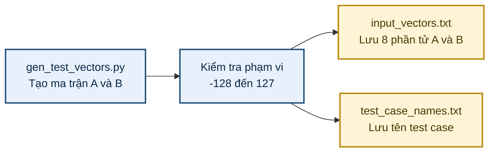
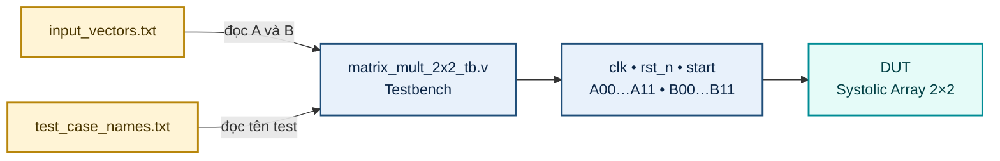
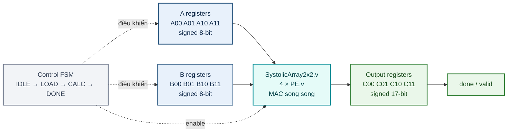
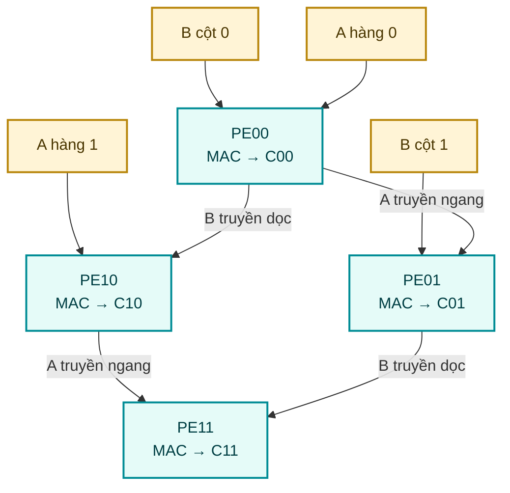
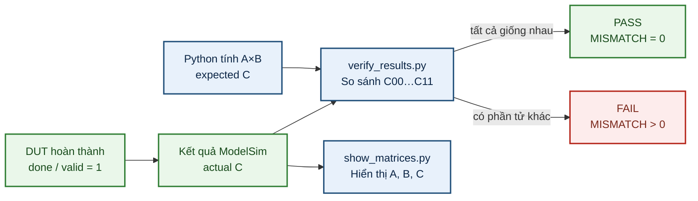
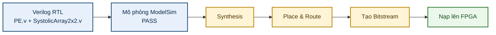

## Authors 

Võ Hoàng Minh Lộc . Trần thiên phúc 
|Advisor: T.S. Phạm Thế Vinh|
Khoa Vi mạch Bán dẫn – Ô tô, Phân hiệu Trường Đại học FPT tại TP.HCM, Việt Nam
---


**Bộ nhân ma trận 2×2 bằng Systolic Array – Verilog, ModelSim và Python**

     **PE.v**

Ý nghĩa: File này định nghĩa một Processing Element (PE), tức một khối xử lý cơ bản trong mảng systolic. PE thực hiện phép nhân–cộng dồn MAC, đồng thời giữ và truyền dữ liệu sang PE kế tiếp.
Cách hoạt động: Ở mỗi cạnh lên của clock, PE nhận hai số có dấu 8 bit A và B, tính tích A×B rồi cộng vào thanh ghi tích lũy. Tích của hai số 8 bit cần 16 bit. Vì một phần tử của ma trận C là tổng của hai tích nên thanh ghi kết quả cần 17 bit để tránh tràn. Dữ liệu A được chuyển sang phải và dữ liệu B được chuyển xuống dưới.
Ví dụ minh họa:
Giả sử PE đang tính C00:
Chu kỳ 1: A00 = 1, B00 = 5  → accumulator = 0 + 1×5 = 5
Chu kỳ 2: A01 = 2, B10 = 7  → accumulator = 5 + 2×7 = 19
Kết quả cuối cùng: C00 = 19

Trường hợp biên: (-128)×(-128) + (-128)×(-128) = 32768,
vì vậy cần đầu ra signed 17 bit.

     **SystolicArray2x2.v**

Ý nghĩa: Đây là module RTL chính, ghép bốn PE thành mảng systolic 2×2. Bốn PE tương ứng với bốn phần tử C00, C01, C10 và C11 của ma trận kết quả.
Cách hoạt động: Module phân phối dữ liệu ma trận A theo chiều ngang và dữ liệu ma trận B theo chiều dọc. Các PE hoạt động song song theo clock. Mỗi PE thực hiện hai lần MAC để hoàn thành một phần tử C. Module cũng nhận reset để xóa kết quả cũ và xuất bốn giá trị signed 17 bit. Đây là file được tổng hợp để triển khai lên FPGA.
Ví dụ minh họa:
A = [[1, 2],        B = [[5, 6],
     [3, 4]]             [7, 8]]

C00 = 1×5 + 2×7 = 19     C01 = 1×6 + 2×8 = 22
C10 = 3×5 + 4×7 = 43     C11 = 3×6 + 4×8 = 50

Kết quả C = [[19, 22], [43, 50]].


     **matrix_mult_2x2_tb.v**

Ý nghĩa: Đây là testbench dùng để mô phỏng và kiểm tra hai file RTL trên ModelSim. Testbench không phải mạch phần cứng thực tế nên không được tổng hợp hoặc nạp lên FPGA.
Cách hoạt động: File tạo clock, kích hoạt reset, đọc từng test case từ input_vectors.txt và đưa tám phần tử A00…A11, B00…B11 vào thiết kế. Sau số chu kỳ cần thiết, testbench đọc C00…C11, in ma trận kết quả ra cửa sổ Transcript hoặc ghi ra file để Python kiểm tra. Nó lặp lại quy trình cho toàn bộ test case.
Ví dụ minh họa:
Ví dụ một lần mô phỏng:
Reset = 1 → xóa kết quả trong các PE
Reset = 0 → đưa A = [[1,2],[3,4]], B = [[5,6],[7,8]]
Chờ mạch hoàn thành → đọc C = [[19,22],[43,50]]
Transcript có thể in: TEST 1 - Positive basic - COMPLETED

     **input_vectors.txt**

Ý nghĩa: File văn bản chứa dữ liệu đầu vào cho tất cả phép thử. Nhờ đọc dữ liệu từ file, testbench có thể chạy nhiều ma trận tự động mà không cần sửa lại mã Verilog.
Cách hoạt động: Mỗi dòng thường chứa tám số có dấu 8 bit: bốn phần tử của A rồi đến bốn phần tử của B. Các test case nên bao phủ số dương, số âm, số 0, ma trận đơn vị, giá trị -128/127, ma trận toàn âm, kết quả bằng 0, đổi dấu và trường hợp gần giới hạn tràn.
Ví dụ minh họa:
Dòng dữ liệu:
1 2 3 4 5 6 7 8

Được hiểu là:
A = [[1,2],[3,4]] và B = [[5,6],[7,8]]
Kết quả mong đợi: C = [[19,22],[43,50]].


     **test_case_names.txt**

Ý nghĩa: File chứa tên hoặc nhãn của từng test case, theo đúng thứ tự các dòng dữ liệu trong input_vectors.txt. Nó giúp kết quả mô phỏng dễ đọc và dễ xác định phép thử nào bị sai.
Cách hoạt động: Khi testbench xử lý dòng thứ n trong input_vectors.txt, nó lấy dòng thứ n trong test_case_names.txt làm tên hiển thị. Vì vậy số lượng và thứ tự tên test nên khớp với số lượng và thứ tự các bộ ma trận đầu vào.
Ví dụ minh họa:
Ví dụ nội dung:
Positive basic
Contains negative values
Zero matrix A
Identity matrix
Maximum and minimum values

Nếu phép thử thứ 2 sai, ModelSim/Python có thể báo:
MISMATCH - Contains negative values.


     **gen_test_vectors.py**

Ý nghĩa: Chương trình Python dùng để tạo các bộ ma trận kiểm tra và ghi chúng vào input_vectors.txt. Đây là phần tạo dữ liệu đầu vào cho quá trình kiểm chứng tự động.
Cách hoạt động: Chương trình có thể chứa các test cố định và sinh thêm ma trận ngẫu nhiên. Trước khi ghi file, nó kiểm tra mọi phần tử nằm trong phạm vi signed 8 bit từ -128 đến 127. Chương trình cũng có thể tính trước kết quả phần mềm để phục vụ đối chiếu.
Ví dụ minh họa:
Ví dụ Python sinh:
A = [[-1, 2], [3, -4]]
B = [[5, -6], [-7, 8]]

Dòng ghi vào input_vectors.txt:
-1 2 3 -4 5 -6 -7 8

Kết quả phần mềm: C = [[-19, 22], [43, -50]].

     **show_matrices.py**

Ý nghĩa: Chương trình Python dùng để hiển thị dữ liệu dưới dạng ma trận 2×2 dễ đọc. File này chủ yếu hỗ trợ quan sát và trình bày, không điều khiển FPGA và không thay đổi kết quả mô phỏng.
Cách hoạt động: Chương trình đọc tám giá trị đầu vào hoặc kết quả đã lưu, sau đó sắp xếp thành các hàng và cột của A, B, C. Điều này giúp phát hiện nhanh việc nhập sai thứ tự phần tử.
Ví dụ minh họa:
Thay vì hiển thị: 1 2 3 4 5 6 7 8
Chương trình in:
Matrix A:        Matrix B:
[1  2]           [5  6]
[3  4]           [7  8]

Result C:
[19 22]
[43 50]


     **verify_results.py**

Ý nghĩa: Đây là chương trình kiểm chứng theo mô hình chuẩn (golden model). Nó xác nhận mạch Verilog có cho kết quả giống phép nhân ma trận được tính bằng phần mềm hay không.
Cách hoạt động: Chương trình đọc A và B, tự tính expected C bằng công thức nhân ma trận, sau đó đọc actual C do ModelSim/testbench tạo ra. Nó so sánh lần lượt C00, C01, C10, C11 của từng test case, đếm match/mismatch và đưa ra kết luận cuối cùng.
Ví dụ minh họa:
Ví dụ kết quả đúng:
Expected: [[19,22],[43,50]]
ModelSim: [[19,22],[43,50]]
MATCH = 4, MISMATCH = 0 → PASS

Ví dụ nếu ModelSim cho C11 = 49:
Expected C11 = 50, Actual C11 = 49
MATCH = 3, MISMATCH = 1 → FAIL.

Ghi chú: Hai file RTL chính để tổng hợp phần cứng là PE.v và SystolicArray2x2.v. Các file còn lại phục vụ tạo dữ liệu, mô phỏng, hiển thị và kiểm chứng kết quả.


# Sơ đồ khối theo từng bước – Bộ nhân ma trận 2×2 Systolic Array

## Bước 1. Tạo dữ liệu kiểm tra bằng Python

`gen_test_vectors.py` tạo các ma trận A, B có phần tử signed 8 bit và ghi dữ liệu kiểm tra ra hai file văn bản.



Ví dụ một dòng trong `input_vectors.txt`:

```text
1 2 3 4 5 6 7 8
```

Tương ứng với `A = [[1,2],[3,4]]` và `B = [[5,6],[7,8]]`.

---

## Bước 2. Testbench đưa dữ liệu vào thiết kế

Testbench đọc từng bộ dữ liệu, tạo clock/reset/start và đưa các phần tử ma trận vào DUT trên ModelSim.



Project `matmul2x2.mpf` lưu các thiết lập ModelSim để compile và chạy testbench.

---

## Bước 3. Kiến trúc bên trong DUT

DUT gồm thanh ghi đầu vào, bộ điều khiển FSM, mảng 4 PE và thanh ghi kết quả.



Hai file RTL chính của DUT là `PE.v` và `SystolicArray2x2.v`.

---

## Bước 4. Luồng dữ liệu trong mảng 4 PE

Ma trận A truyền theo chiều ngang, ma trận B truyền theo chiều dọc. Mỗi PE thực hiện hai lần nhân–cộng dồn để tạo một phần tử C.



Ví dụ:

```text
C00 = A00×B00 + A01×B10
C01 = A00×B01 + A01×B11
C10 = A10×B00 + A11×B10
C11 = A10×B01 + A11×B11
```

---

## Bước 5. Thu và kiểm chứng kết quả

Khi `done/valid = 1`, testbench đọc bốn phần tử C. Python tính kết quả chuẩn và so sánh từng phần tử.



Ví dụ kết quả đúng:

```text
Expected: [[19,22],[43,50]]
ModelSim: [[19,22],[43,50]]
MATCH = 4, MISMATCH = 0 → PASS
```

---

## Bước 6. Triển khai thiết kế lên FPGA

Sau khi mô phỏng và kiểm chứng thành công, hai file RTL được tổng hợp để tạo bitstream và nạp lên FPGA.



## Tóm tắt luồng hoạt động

```text
Python tạo dữ liệu
        ↓
Testbench đọc dữ liệu và điều khiển DUT
        ↓
4 PE thực hiện nhân–cộng dồn
        ↓
ModelSim xuất ma trận C
        ↓
Python so sánh và báo PASS/FAIL
        ↓
Tổng hợp và nạp thiết kế lên FPGA
```
