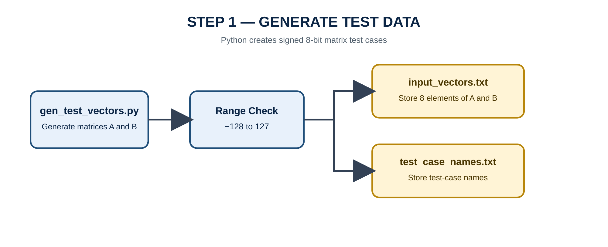
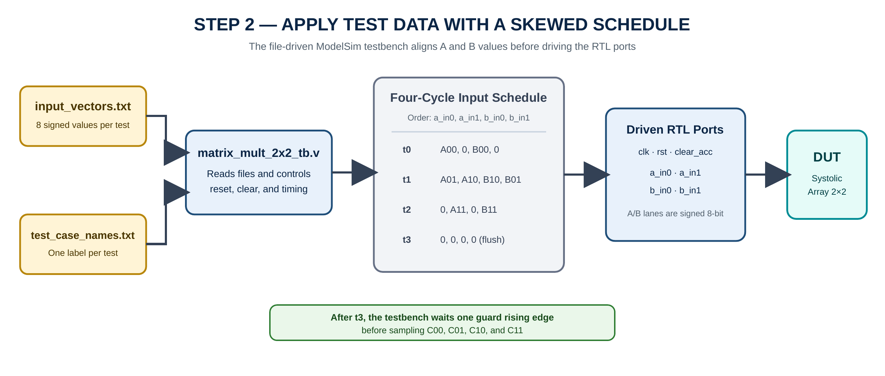
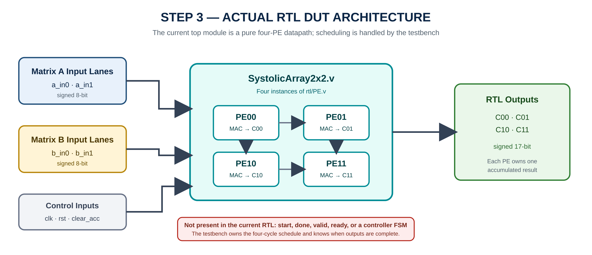
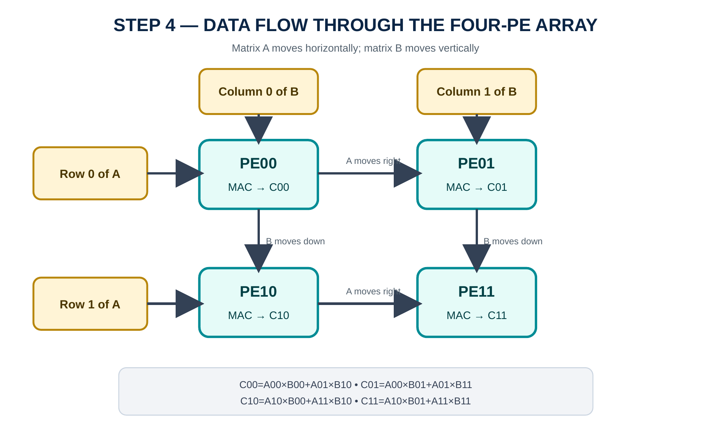
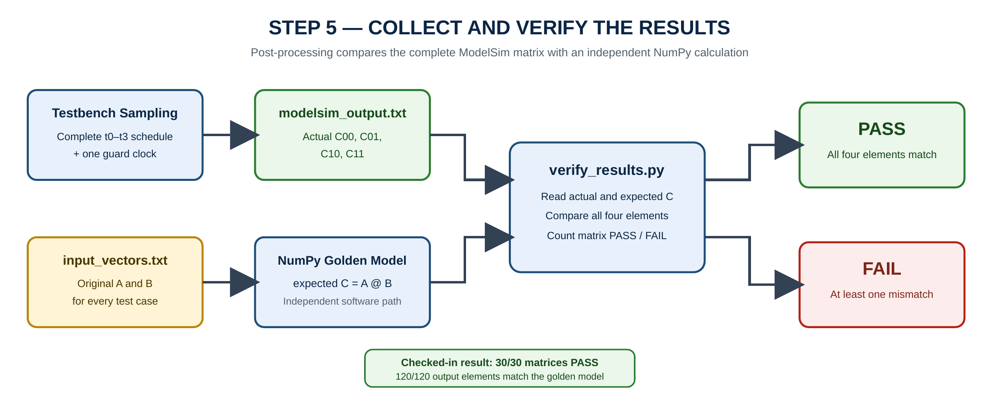
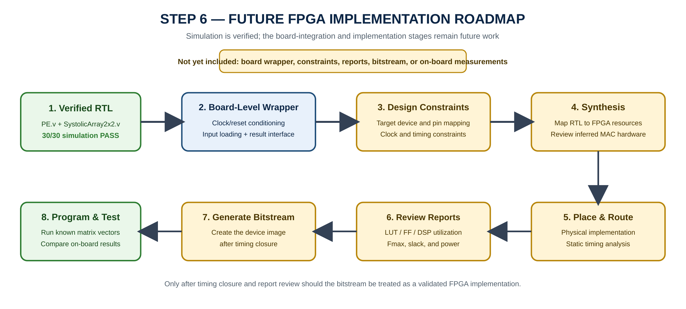
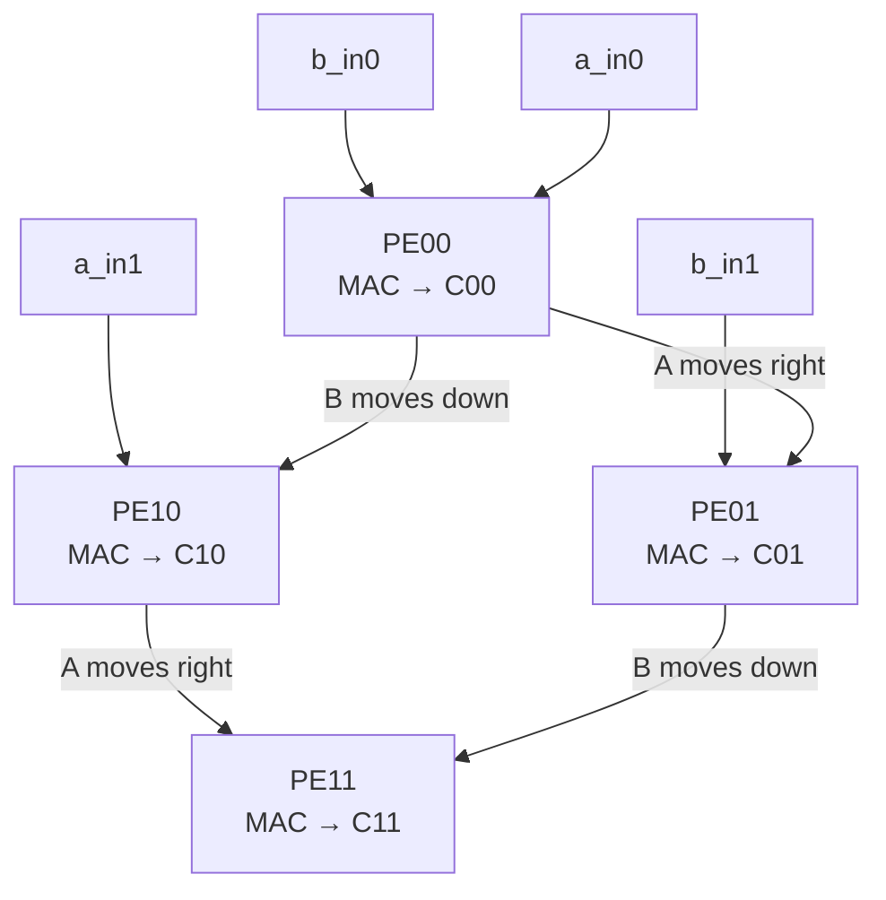
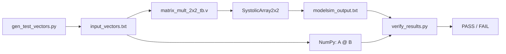

# Signed INT8 2×2 Matrix Multiplier Using a Systolic Array on FPGA

A synthesizable Verilog RTL implementation of a signed 2×2 matrix multiplier using a four-cell systolic array. Matrix elements are represented as **signed INT8 values**, while every output element is accumulated in **signed 17-bit precision** to preserve the full mathematical result without overflow.

The design is verified with a file-driven ModelSim testbench and an independent NumPy golden model. The checked-in dataset contains **30 test cases**—10 directed corner cases and 20 deterministic random cases—and the recorded RTL output matches Python for **30/30 matrices and 120/120 output elements**.

---

## Authors

**Võ Hoàng Minh Lộc · Trần Thiên Phúc**  
**Advisor:** Dr. Phạm Thế Vinh  
Faculty of Semiconductor Integrated Circuits and Automotive Engineering, FPT University Ho Chi Minh City Campus, Vietnam

---

## Contents

- [Key Results](#key-results)
- [End-to-End Workflow](#end-to-end-workflow)
- [Scope](#scope)
- [Matrix Multiplication](#matrix-multiplication)
- [Architecture](#architecture)
- [Skewed Input Schedule](#skewed-input-schedule)
- [Bit-Width Rationale](#bit-width-rationale)
- [Verification Strategy](#verification-strategy)
- [Repository Structure](#repository-structure)
- [Running the Verification](#running-the-verification)
- [Current Limitations](#current-limitations)
- [Future Work](#future-work)

---

## Key Results

| Item | Result |
|---|---:|
| Matrix size | 2×2 |
| Input format | Signed INT8 (`-128` to `127`) |
| Output format | Signed 17-bit |
| Processing elements | 4 parallel MAC cells |
| Directed test cases | 10 |
| Random test cases | 20, generated with seed `42` |
| Verified matrices | **30/30 PASS** |
| Verified output elements | **120/120 match** |
| Maximum checked output | `32768` |

> The repository contains simulation results and software verification. FPGA synthesis, timing, resource-utilization, board constraints, and bitstream files are not yet included.

---

## End-to-End Workflow

The project is organized as a six-step flow. Steps 1–5 describe the workflow that is implemented and verified in the current repository. Step 6 is a clearly separated roadmap for deploying the verified RTL on a physical FPGA.

### Step 1 — Generate Reproducible Signed INT8 Test Data

`golden_model/gen_test_vectors.py` creates two 2×2 matrices for every test case. Each matrix element is checked against the signed 8-bit range `-128` to `127`. The generator writes eight input values—four values of A followed by four values of B—to `input_vectors.txt`, while the matching human-readable test name is written to `test_case_names.txt`.

The checked-in dataset contains 10 directed corner cases and 20 deterministic random cases generated with seed `42`.

<p align="center">
  
</p>

### Step 2 — Read the Files and Apply a Four-Cycle Skewed Schedule

`sim/matrix_mult_2x2_tb.v` reads one test vector and one label at a time. It resets the DUT, asserts `clear_acc` to remove the previous accumulated values, and then drives `a_in0`, `a_in1`, `b_in0`, and `b_in1` over four rising clock edges.

The input values are intentionally skewed: matrix A moves horizontally through the PE rows, while matrix B moves vertically through the PE columns. A final all-zero cycle flushes the last operands into `PE11`. The testbench then waits one guard rising edge before sampling the outputs.

<p align="center">
  
</p>

### Step 3 — Execute the Actual Four-PE RTL Datapath

The synthesizable top module, `rtl/SystolicArray2x2.v`, instantiates exactly four copies of `rtl/PE.v`. The current interface contains two signed 8-bit A lanes, two signed 8-bit B lanes, `clk`, active-high asynchronous `rst`, and synchronous `clear_acc`. Each PE produces one signed 17-bit matrix result.

The current RTL contains no `start`, `done`, `valid`, `ready`, controller FSM, or board-level I/O wrapper. Those functions are intentionally kept outside the core, and simulation timing is controlled by the testbench.

<p align="center">
  
</p>

### Step 4 — Move Data Through the Systolic Array

Within each PE, the current A and B inputs are multiplied and accumulated, then A is registered toward the right and B is registered downward. This local communication pattern lets the four cells form a compact systolic structure without a centralized crossbar.

- `PE00` accumulates `C00`.
- `PE01` receives A from `PE00` and accumulates `C01`.
- `PE10` receives B from `PE00` and accumulates `C10`.
- `PE11` receives A from `PE10` and B from `PE01`, then accumulates `C11`.

<p align="center">
  
</p>

### Step 5 — Compare ModelSim Against an Independent Golden Model

After the schedule and guard clock are complete, the testbench writes the four signed RTL outputs to `modelsim_output.txt`. `golden_model/verify_results.py` independently reconstructs A and B from `input_vectors.txt`, calculates `A @ B` with NumPy, and compares all four output elements.

A matrix passes only if `C00`, `C01`, `C10`, and `C11` all match. The checked-in files produce **30/30 passing matrices and 120/120 matching elements**.

<p align="center">
  
</p>

### Step 6 — Future FPGA Deployment Roadmap

Simulation verification does not by itself prove that a bitstream has been generated or that the circuit meets timing on a specific FPGA. Physical deployment still requires a target-device wrapper, clock/reset conditioning, an input/output method, pin assignments, timing constraints, synthesis, place-and-route, timing/resource review, bitstream generation, and on-board tests.

The following diagram is therefore a **future implementation roadmap**, not a claim that these artifacts already exist in the repository.

<p align="center">
  
</p>

---

## Scope

This project focuses on the arithmetic datapath and verification flow for one signed 2×2 matrix multiplication:

- Four reusable Processing Elements (`PE.v`)
- A 2×2 systolic interconnect (`SystolicArray2x2.v`)
- Skewed input scheduling performed by the testbench
- File-driven ModelSim simulation
- Independent post-processing verification with Python and NumPy

The current RTL is a small, educational systolic-array core. It does not yet include a board-level top module, an FSM, a `valid/ready` interface, memory-mapped I/O, an AXI interface, or a continuous stream of back-to-back matrices.

---

## Matrix Multiplication

For two matrices:

```text
        | A00  A01 |          | B00  B01 |
A   =   |          |    B  =  |          |
        | A10  A11 |          | B10  B11 |
```

the result is:

```text
        | C00  C01 |
C   =   |          |
        | C10  C11 |
```

where:

```text
C00 = A00×B00 + A01×B10
C01 = A00×B01 + A01×B11
C10 = A10×B00 + A11×B10
C11 = A10×B01 + A11×B11
```

Each output therefore requires two signed multiplications and one accumulation.

---

## Architecture

The hardware consists of four identical PEs connected as a 2×2 systolic array.



### Processing Element (`rtl/PE.v`)

Each PE contains:

- One signed `8×8 → 16-bit` multiplier
- One signed 17-bit accumulator
- An 8-bit horizontal forwarding register for matrix A
- An 8-bit vertical forwarding register for matrix B
- A synchronous `clear_acc` input that clears only the accumulated sum
- An asynchronous active-high `rst` input that clears forwarding registers and the accumulator

At every rising clock edge:

```text
a_out   ← a_in
b_out   ← b_in
sum_out ← sum_out + sign_extend(a_in × b_in)
```

When `clear_acc = 1`, `sum_out` is set to zero before a new matrix multiplication.

### Systolic Array (`rtl/SystolicArray2x2.v`)

The top RTL module instantiates four PEs:

| PE | A source | B source | Output |
|---|---|---|---|
| `PE00` | `a_in0` | `b_in0` | `C00` |
| `PE01` | `PE00.a_out` | `b_in1` | `C01` |
| `PE10` | `a_in1` | `PE00.b_out` | `C10` |
| `PE11` | `PE10.a_out` | `PE01.b_out` | `C11` |

`PE00` is closest to the external inputs, while `PE11` is the farthest cell and produces the last completed result.

---

## Skewed Input Schedule

The testbench aligns matrix elements in time so that the correct A and B values meet inside every PE.

| Cycle | `a_in0` | `a_in1` | `b_in0` | `b_in1` | Main operations |
|---|---:|---:|---:|---:|---|
| `t0` | `A00` | `0` | `B00` | `0` | `PE00`: first term of `C00` |
| `t1` | `A01` | `A10` | `B10` | `B01` | `PE00`: second `C00` term; `PE01`/`PE10`: first terms |
| `t2` | `0` | `A11` | `0` | `B11` | `PE01`/`PE10`: second terms; `PE11`: first term |
| `t3` | `0` | `0` | `0` | `0` | `PE11`: second term of `C11` |

The testbench then waits one additional guard clock before writing `C00`, `C01`, `C10`, and `C11` to `modelsim_output.txt`.

This version does not generate `done` or `valid`. Output timing is controlled by the known four-cycle schedule in `matrix_mult_2x2_tb.v`.

---

## Bit-Width Rationale

Each input is a signed 8-bit two's-complement value:

```text
-128 ≤ Aij, Bij ≤ 127
```

The exact signed product range is:

```text
-16256 ≤ Aij × Bij ≤ 16384
```

Therefore, every partial product requires signed 16-bit storage. Each output is the sum of two products:

```text
Cij = product_0 + product_1
```

The largest positive case is:

```text
(-128 × -128) + (-128 × -128) = 32768
```

Because signed 16-bit arithmetic stops at `32767`, the accumulator and outputs are widened to signed 17-bit.

---

## Verification Strategy

Verification uses independent RTL and software paths:



### Layer 1 — Directed Corner Cases

The generator includes 10 directed tests:

1. Both matrices are zero
2. Identity matrix multiplied by an arbitrary matrix
3. Arbitrary matrix multiplied by the identity matrix
4. Both matrices contain only negative values
5. Maximum signed INT8 value (`127`)
6. Minimum signed INT8 value (`-128`), producing the maximum checked result `32768`
7. Mixed extreme values (`127` and `-128`)
8. Sign changes during accumulation
9. Products that cancel to zero
10. Alternating zeros, negative values, and positive values

### Layer 2 — Deterministic Random Tests

`gen_test_vectors.py` adds 20 random matrix pairs across the full signed INT8 range. The seed is fixed to `42`, so the dataset is reproducible.

### Layer 3 — Independent Golden Model

`verify_results.py` reconstructs A and B with NumPy and calculates:

```python
C_expected = A @ B
```

It then compares the complete 2×2 matrix against the ModelSim result using `numpy.array_equal()`.

### Verified Repository Result

The checked-in files were re-evaluated directly from this repository:

```text
TOTAL: 30 PASS / 0 FAIL / 30 tests
Element-level result: 120 / 120 output values match
```

Representative boundary result:

```text
A = [[-128, -128], [-128, -128]]
B = [[-128, -128], [-128, -128]]
C = [[32768, 32768], [32768, 32768]]
```

---

## Repository Structure

```text
.
├── rtl/
│   ├── PE.v                       # Signed 8-bit MAC processing element
│   └── SystolicArray2x2.v         # Four-PE 2×2 systolic array
├── sim/
│   └── matrix_mult_2x2_tb.v       # File-driven ModelSim testbench
├── golden_model/
│   ├── gen_test_vectors.py        # Directed + random test generation
│   ├── show_matrices.py           # Human-readable matrix display
│   └── verify_results.py          # NumPy golden-model comparison
├── data/
│   ├── input_vectors.txt          # 30 A/B input pairs
│   └── test_case_names.txt        # Matching test labels
├── result/
│   └── modelsim_output.txt        # Checked-in RTL output
├── docs/
│   └── figures/                   # Workflow and architecture diagrams
└── README.md
```

---

## File Summary

| File | Role |
|---|---|
| `rtl/PE.v` | Performs signed multiply–accumulate and forwards A/B data |
| `rtl/SystolicArray2x2.v` | Connects four PEs into a 2×2 systolic array |
| `sim/matrix_mult_2x2_tb.v` | Applies the skewed schedule and writes ModelSim results |
| `golden_model/gen_test_vectors.py` | Generates 10 directed and 20 random tests |
| `golden_model/show_matrices.py` | Prints A, B, and C in matrix form |
| `golden_model/verify_results.py` | Compares RTL results with NumPy |
| `data/input_vectors.txt` | Stores eight signed inputs per test case |
| `data/test_case_names.txt` | Stores the test descriptions |
| `result/modelsim_output.txt` | Stores four signed outputs per test case |
| `docs/figures/*.png` | Documents the test, RTL, verification, and future FPGA flow |

---

## Requirements

- ModelSim or QuestaSim with Verilog support
- Python 3.9 or newer
- NumPy

Install the Python dependency:

```bash
python -m pip install numpy
```

---

## Running the Verification

The scripts and testbench use path-less filenames, so the easiest reproducible method is to run everything from a separate `run/` directory.

### 1. Clone the repository

```bash
git clone https://github.com/minhloc203/matrix_multiplier_2x2.git
cd matrix_multiplier_2x2
```

### 2. Create a simulation workspace and generate tests

```bash
mkdir run
cd run
python ../golden_model/gen_test_vectors.py
```

This creates:

```text
input_vectors.txt
test_case_names.txt
```

### 3. Compile and run ModelSim

```tcl
vlib work
vlog ../rtl/PE.v
vlog ../rtl/SystolicArray2x2.v
vlog ../sim/matrix_mult_2x2_tb.v
vsim -c matrix_mult_2x2_tb -do "run -all; quit -f"
```

The testbench creates:

```text
modelsim_output.txt
```

### 4. Display matrices

```bash
python ../golden_model/show_matrices.py
```

### 5. Compare RTL with the golden model

```bash
python ../golden_model/verify_results.py
```

A successful run ends with:

```text
TOTAL: 30 PASS / 0 FAIL / 30 tests
```

### Verify the checked-in result without rerunning ModelSim

```bash
mkdir run
cp data/input_vectors.txt data/test_case_names.txt result/modelsim_output.txt run/
cd run
python ../golden_model/verify_results.py
```

---

## Example

For:

```text
A = [[1, 2],        B = [[5, 6],
     [3, 4]]             [7, 8]]
```

the expected output is:

```text
C = [[19, 22],
     [43, 50]]
```

The four PEs calculate these four elements concurrently as the skewed data moves through the array.

---

## Current Limitations

- Fixed matrix size of 2×2
- Fixed signed INT8 inputs and signed 17-bit outputs
- No parameterized matrix dimension
- No `valid/ready` handshake or `done` output
- No controller FSM in the RTL
- Testbench controls input skewing and output timing
- Accumulators are cleared between matrices, so back-to-back streaming is not implemented
- No FPGA board-level top module or pin constraints
- No checked-in synthesis, timing, power, or resource-utilization report

---

## Future Work

- Add `start`, `done`, and `valid/ready` control signals
- Move the skewing schedule from the testbench into synthesizable control logic
- Parameterize matrix size and data width
- Support larger systolic arrays and tiled matrix multiplication
- Add continuous back-to-back matrix processing
- Add a board-level wrapper, clock divider/UART interface, and pin constraints
- Synthesize on the target Gowin FPGA and publish LUT, register, DSP, Fmax, and power results
- Add automated regression scripts and continuous integration

---

## References

1. H. T. Kung, “Why Systolic Architectures?,” *Computer*, vol. 15, no. 1, pp. 37–46, Jan. 1982, doi: `10.1109/MC.1982.1653825`.
2. IEEE Standard for Verilog Hardware Description Language, IEEE Std 1364.
3. NumPy documentation, “`numpy.matmul` — Matrix product of two arrays.”

---

## License

No license file is currently included in this repository. Add a license before redistributing or reusing the project outside its intended academic context.
